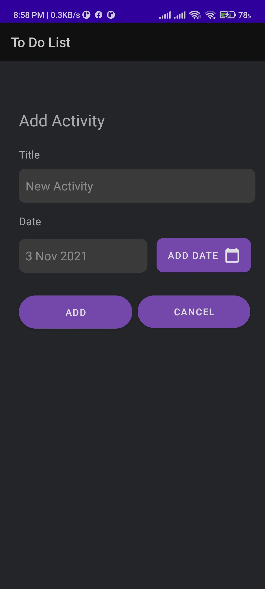
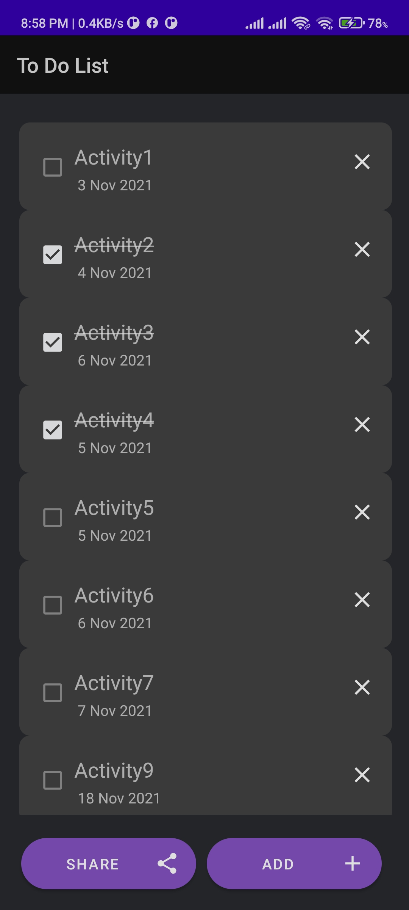

#[Todo List App](https://github.com/AazamJutt/Mobile-Computing/tree/TodoList-App)

### Developed By [Aazam Jutt](https://github.com/AazamJutt)

## Description

A simple Todo List manager app that takes Title and Due Date for a task and displays it
in a Scroll View, You can mark a Todo taks as DONE, DELETE it and SHare your complete Todo Tasks report as a text. Data is stored on a file on Insertions and Deletion and later Read onCreate event. 
                                 

## Screenshots

* Add Activity Screen.

* Todo List View.

